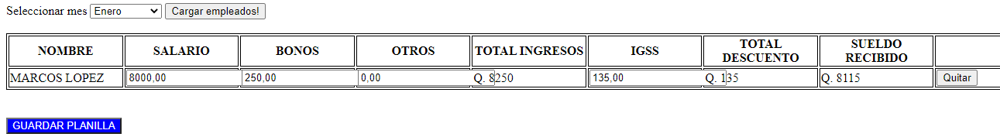

# PRACTICA PLANILLA, EJEMPLO CARGAR EMPLEADOS Y EDITAR VALORES PRE PLANILL PARA REGISTRO MASIVO DE TODOS LOS EMPLEADOS DURANTE UN MES.

NOTA: Este proyecto es puramente práctica, de como modificar los ingresos, descuentos a una lista de empleados, y generar masivamente la planilla respective de un mes a todos los empleados.

